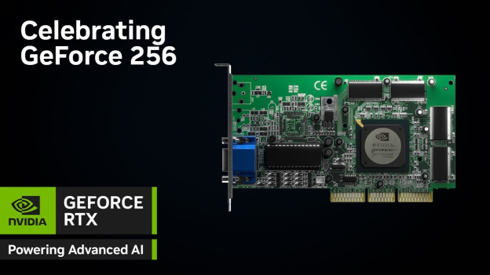
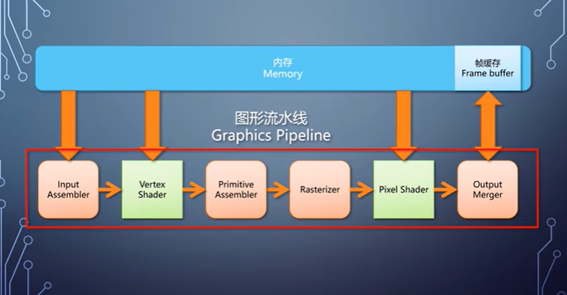
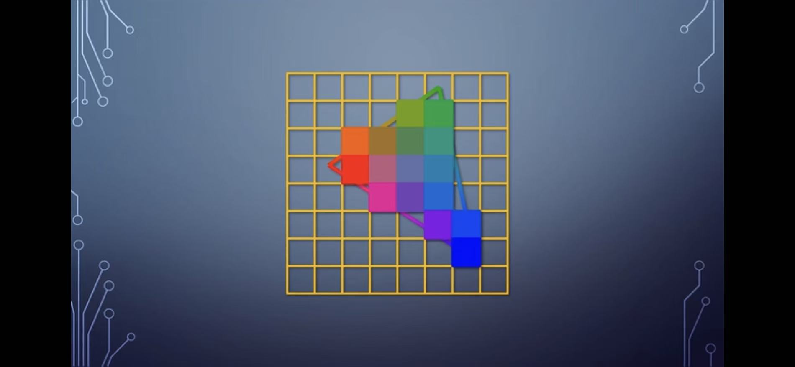
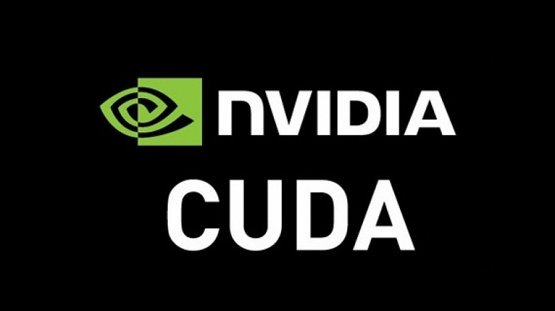

# 概述——GPGPU的前世今生

> ”世上本没有路，走的人多了，也便成了路。"——鲁迅

## GPU的诞生

最初是没有GPU的，CPU把每个像素的RGB信息依次写入内存中的Frame Buffer，再输出到显示器上进行显示。

随着游戏的发展，对于图形处理的需求日益显现。

于是，市面上出现了多家提供显卡方案的厂家，比如S3/Trident/Voodoo等。

>1999年10月，Nvidia发布了世界上第一块被称作GPU的GeForce 256

> 主流GPU基本图形流水线 

术语：
* Vertex 顶点：一般包括位置position<x,y,z>，法线方向normal<x,y,z>，颜色color<r,g,b,a>和纹理坐标texture coordinate<x,y>等信息
* Primitive 图元：包括点、线、三角形、四边形等简单形状
* Rasterize 光栅化：填充三角形所覆盖的像素
* Vertex/Pixel Shader：可编程模块，单入单出

> Rasterizer

## GPGPU的雏形

早期GPU中Vertex/Pixel Shader的数量是固定的，而GPU的应用场景却千差万别，这就造成了硬件利用率低下的情况。

为此，微软在设计Xbox360游戏机的时候，提出了Unified Shader概念。Unified Shader兼具**通用性**和**可编程性**，极大提高了硬件利用率。

虽然Unified Shader本意是为了解决图形处理问题，但是却为之后GPGPU的出现埋下了伏笔。

很快，学者们就找到了利用GPU将矩阵数据映射成纹理，并调用Unified Shader进行数学运算的方法。

## GPGPU的出现

受此启发，Nvidia敏锐地捕捉到了使用GPU进行通用计算的需求，并且开始着手设计硬件进行支持。

2002年Nvidia提出了GPGPU的概念。

2006年11月，Nvidia发布了CUDA（Compute Unified Device Architecture），极大方便了普通开发者使用GPGPU。

## 区别

> CPU与GPU的芯片布局

CPU就好比一名数学博士，可以解出少量非常复杂的数学难题；而GPU就好比成千上万的小学生，可以同时并行解出海量简单的数学题。

*参考：B站——上帝视角看GPU*
